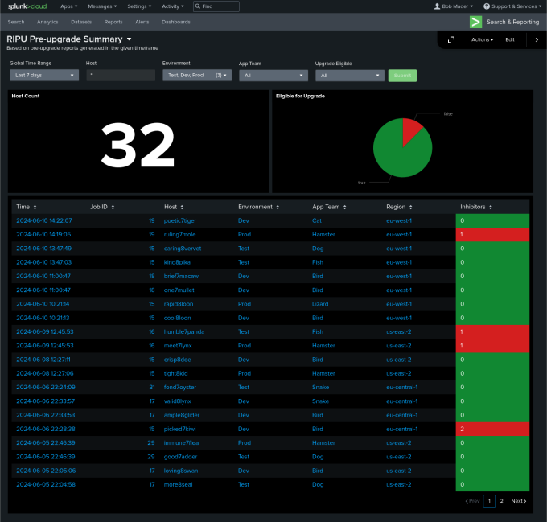
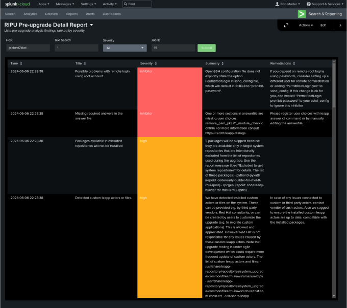

# Example RHEL In-place Upgrade Automation Dashboards

## Overview

The RHEL in-place upgrade (RIPU) automation approach recommends creating reporting dashboards to make it easy to analyze pre-upgrade results and visualize the progress of upgrades across your RHEL estate. This reference implementation provides a collection of example dashboards that can be demonstrated using the RHEL in-place upgrade automation workshop catalog item on Red Hat Demo Platform (RHDP).

There are a number of event logging platforms that could be leveraged, however, most large enterprise customers have Splunk, so that is what we will use to create our example dashboards. This way, the example dashboards serve as a reusable starting point to accelerate the development of custom dashboards with our customers.

## Dashboard source files

There are three example dashboards included with this reference implementation. Each dashboard is provided as a json file that can be imported into Splunk Dashboard Studio.

- [Pre-upgrade Summary Dashboard](./dashboards/ripu-preupg-summary.json)
- [Pre-upgrade Detail Report](./dashboards/ripu-preupg-detail.json)
- [Upgrade Progress Timeline](./dashboards/ripu-upgrade-timeline.json)

## Screenshots

## Data structure of RIPU events

The data presented by the example dashboards comes from events sent when Analysis and Upgrade jobs are executed in the RHDP workshop lab environment. For example, refer to the "Send event to Splunk" tasks of the following Ansible playbooks:

- [`analysis.yml`](https://github.com/redhat-partner-tech/leapp-project/blob/41f82640a92d021671954f77c2232654e7aa69bb/analysis.yml#L75-L100)
- [`upgrade.yml`](https://github.com/redhat-partner-tech/leapp-project/blob/41f82640a92d021671954f77c2232654e7aa69bb/upgrade.yml#L27-L53)

Each RIPU event includes the following data objects:

- `event_type` (string) either `playbook_run` indicating the event includes the status of a RHEL in-place upgrade automation workflow job or `leapp_report` indicating the event includes a Leapp pre-upgrade report.
- `hostname` (string) is the short hostname of the pet app server.
- `os_version` (string) the RHEL version, for example, `7.9`, `8.10`, etc.
- `pet_app_env` (string) operational environment of the pet app server. It will be one of: `Dev`, `Test`, or `Prod`. 
- `pet_app_team` (string) name of the team responsible for the pet app server. It will be one of: `Bird`, `Cat`, `Dog`, `Fish`, `Hamster`, `Lizard`, or `Snake`.
- `region` (string) the AWS region or `undefined` if not an AWS instance.

Events of type `playbook_run` include the following additional data objects:

- `play_name` (string) ansible_play_name from the job being reported, for example, `Analysis`, `Upgrade`, `Rollback`, `Commit`, etc.
- `status` (string) either `success` or `failed` depending on the job status.

Events of type `leapp_report` include a json object containing the Leapp pre-upgrade report: 

- `report` (json) Leapp pre-upgrade report contents copied from the `/var/log/leapp/leapp-report.json` file. The example dashboards support both the original default report schema and the new report schema 1.2.0 [recently adopted](https://github.com/redhat-cop/infra.leapp/pull/216) by the `infra.leapp` collection.

## Contributing

Do you have ideas on how we can improve this? Get started by opening an issue or pull request.

## More information

These example dashboards are offered to demonstrate how we can visualize pre-upgrade results and track progress as upgrades are completed. This is part of our comprehensive approach to making RHEL in-place upgrade automation that works at enterprise scale. Learn more about our end-to-end approach for automating RHEL in-place upgrades at this [blog post](https://red.ht/bobblog).

## Licensing

MIT

See [LICENSE](LICENSE) to see the full text.
